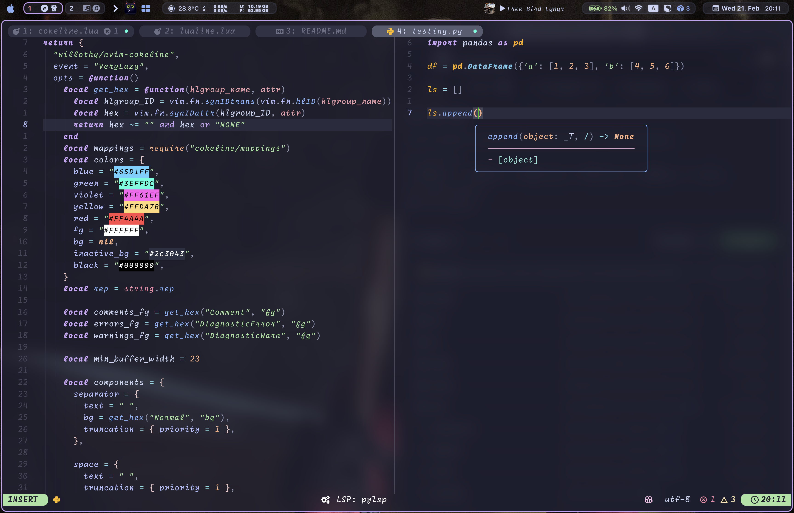

<!-- markdownlint-disable MD013 MD001 -->

# 💤 [LazyVim](https://github.com/LazyVim/LazyVim)

This is my personal configuration based on the LazyVim Neovim distro, I have modified a couple of things to my own personal liking.

## Highlights

### Plugins

- [Cokeline](https://github.com/willothy/nvim-cokeline) instead of [Bufferline](https://github.com/akinsho/bufferline.nvim)

  > The reason behind this is actually very simple, I prefer a more customizable option for the top status bar (buffers mainly), while bufferline does offer some pretty nice themes out of box, I get way more flexibility with cokeline.

- [NvimTree](https://nvim-tree/nvim-tree.lua) instead of [Neotree](https://nvim-neo-tree/neo-tree.nvim)

  > Neotree just hasn't been working out for me since it feels slow and laggy sometimes especially when changing directory, NvimTree on the other hand is simpler but does things very smoothly.

- Modifications on [Lualine](https://github.com/nvim-lualine/lualine.nvim)
  > Only minor tweaks were made to lualine to make it look nicer, such as rounded separators, color tuning, and LSP indicator.

Other than the above mentioned three main subjects, there are still a bunch of minor tweaks here and there that you might find interesting.

Let me know if it works for you well if you've decided to give my config a try.
